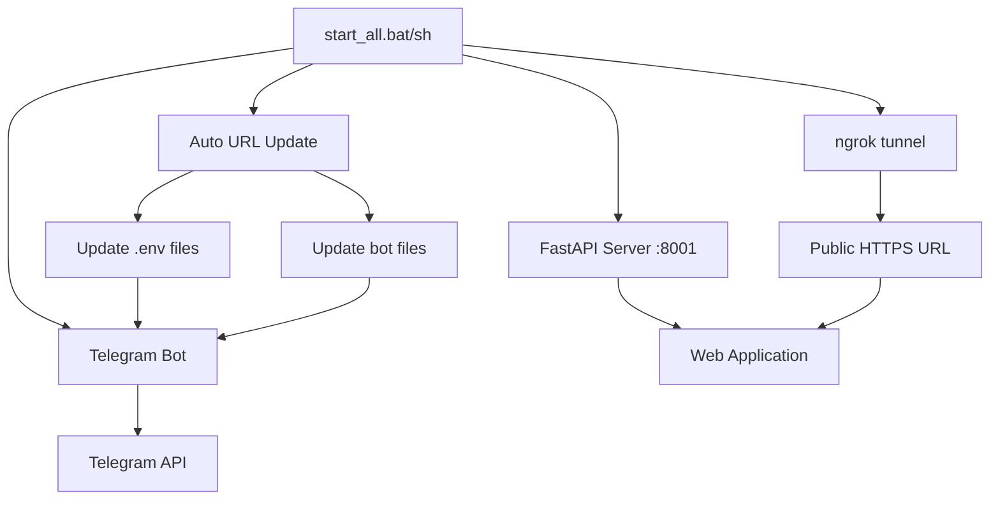

# 🚀 Автоматический запуск Telegram Assistant

Этот документ описывает как запустить весь проект **Telegram Assistant** одной командой.

## 📋 Содержание

- [Быстрый старт](#быстрый-старт)
- [Предварительные требования](#предварительные-требования)
- [Настройка](#настройка)
- [Запуск сервисов](#запуск-сервисов)
- [Устранение неполадок](#устранение-неполадок)
- [Архитектура системы](#архитектура-системы)

## 🚀 Быстрый старт

### Windows
```cmd
# Способ 1: Интерактивное меню
start_windows.bat

# Способ 2: Прямые команды
scripts\windows\setup_bot_token.bat  # Настройка токена (только первый раз)
scripts\windows\start_all.bat        # Запуск всех сервисов
```

### Ubuntu/Linux
```bash
# Способ 1: Интерактивное меню
./start_linux.sh

# Способ 2: Прямые команды  
scripts/linux/setup_bot_token.sh  # Настройка токена (только первый раз)
scripts/linux/start_all.sh        # Запуск всех сервисов
```

## 📋 Предварительные требования

### Общие требования
- **Python 3.8+** установлен в системе
- **Токен Telegram бота** от [@BotFather](https://t.me/BotFather)
- **Интернет-соединение** для работы ngrok и Telegram API

### Windows
- **Windows 10/11**
- **PowerShell** (встроен в Windows)
- **ngrok.exe** в папке проекта

### Ubuntu/Linux
- **Ubuntu 18.04+** или другой Linux дистрибутив
- **bash** shell
- **ngrok** установлен в системе или в папке проекта

### Python зависимости
Установите зависимости командой:
```bash
pip install -r requirements.txt
```

## ⚙️ Настройка

### 1. Получение токена бота

1. Найдите [@BotFather](https://t.me/BotFather) в Telegram
2. Отправьте команду `/newbot` для создания нового бота
3. Следуйте инструкциям и получите токен вида: `1234567890:ABCdef-GHI_jklmnop...`
4. Запустите скрипт настройки:

**Windows:**
```bash
.\setup_bot_token.bat
```

**Linux:**
```bash
./setup_bot_token.sh
```

### 2. Установка ngrok

#### Windows
1. Скачайте [ngrok.exe](https://ngrok.com/download) 
2. Поместите файл `ngrok.exe` в папку проекта

#### Ubuntu/Linux
```bash
# Вариант 1: Через snap
sudo snap install ngrok

# Вариант 2: Скачать в папку проекта
wget https://bin.equinox.io/c/bNyj1mQVY4c/ngrok-v3-stable-linux-amd64.tgz
tar xvzf ngrok-v3-stable-linux-amd64.tgz
```

### 3. Структура файлов

После настройки у вас должна быть такая структура:
```
telegram-assistant/
├── app/
│   ├── .env                    # Общая конфигурация
│   ├── bots/
│   │   ├── .env               # Конфигурация бота
│   │   └── bot1_simple.py     # Основной бот
│   ├── scripts/               # Скрипты управления проектом
│   │   ├── windows/           # Windows .bat скрипты
│   │   │   ├── start_all.bat
│   │   │   ├── setup_bot_token.bat
│   │   │   └── ...
│   │   ├── linux/             # Linux .sh скрипты
│   │   │   ├── start_all.sh
│   │   │   ├── setup_bot_token.sh
│   │   │   └── ...
│   │   └── README.md          # Документация скриптов
│   ├── start_windows.bat      # Лаунчер для Windows
│   ├── start_linux.sh         # Лаунчер для Linux
│   ├── ngrok.exe              # Windows версия ngrok
│   └── auto_update_ngrok_url.py
```

## 🎯 Запуск сервисов

### Автоматический запуск (рекомендуется)

**Windows:**
```cmd
start_windows.bat
# или напрямую:
scripts\windows\start_all.bat
```

**Linux:**
```bash
./start_linux.sh
# или напрямую:
scripts/linux/start_all.sh
```

### Пошаговый запуск

1. **FastAPI сервер:**
   ```bash
   # Windows
   .\start_fastapi.bat
   
   # Linux  
   ./start_fastapi.sh
   ```

2. **ngrok туннель:**
   ```bash
   # Windows
   .\start_ngrok.bat
   
   # Linux
   ./start_ngrok.sh
   ```

3. **Telegram бот:**
   ```bash
   # Windows
   .\start_bot.bat
   
   # Linux
   ./start_bot.sh
   ```

## 🔄 Что происходит при запуске

1. **📦 Проверка зависимостей** - проверяется наличие Python, ngrok, токена
2. **🌐 Запуск FastAPI** - веб-сервер на порту 8001
3. **🔗 Запуск ngrok** - создание публичного туннеля к серверу
4. **🔄 Автообновление URL** - парсинг нового ngrok URL и обновление всех файлов
5. **🤖 Запуск Telegram бота** - активация бота с новым URL

## 🛠️ Устранение неполадок

### Ошибка: "Токен не настроен"
```bash
❌ Ошибка: Не установлен токен бота!
```
**Решение:** Запустите `setup_bot_token.bat/.sh`

### Ошибка: "ngrok не найден"
```bash
❌ ngrok.exe не найден
```
**Решение:** 
- **Windows:** Поместите `ngrok.exe` в папку проекта
- **Linux:** Установите ngrok в систему или папку проекта

### Ошибка: "Conflict: terminated by other getUpdates request"
```bash
telegram.error.Conflict: Conflict: terminated by other getUpdates request
```
**Решение:**
```bash
# Завершите все процессы Python
taskkill /f /im python.exe  # Windows
pkill -f python             # Linux

# Запустите сброс бота
python reset_bot.py
```

### Ошибка: "Port 8001 already in use"
```bash
OSError: [Errno 98] Address already in use
```
**Решение:**
```bash
# Найдите процесс на порту 8001
netstat -ano | findstr :8001  # Windows
lsof -i :8001                 # Linux

# Завершите процесс
taskkill /PID <PID> /F        # Windows
kill -9 <PID>                 # Linux
```

### Ошибка автообновления URL
```bash
❌ Ошибка обновления URL!
```
**Решение:**
```bash
# Проверьте что ngrok запущен
curl http://localhost:4040/api/tunnels

# Запустите обновление URL вручную
python auto_update_ngrok_url.py
```

## 🏗️ Архитектура системы



### Компоненты системы

1. **FastAPI Server** (`main.py`)
   - Веб-приложение для управления задачами
   - REST API для мобильного приложения
   - Порт: 8001

2. **ngrok Tunnel** 
   - Создает публичный HTTPS URL
   - Проксирует запросы к локальному серверу
   - Обновляется при каждом запуске

3. **Auto URL Update** (`auto_update_ngrok_url.py`)
   - Получает новый ngrok URL через API
   - Обновляет конфигурационные файлы
   - Поддерживает разные кодировки файлов

4. **Telegram Bot** (`bots/bot1_simple.py`)
   - Интерфейс бота в Telegram
   - Интеграция с веб-приложением
   - Обработка команд и callback'ов

## 📁 Файлы конфигурации

### `.env` (корневой)
```env
BOT_TOKEN=1234567890:ABCdef...
WEBAPP_URL=https://abc123.ngrok-free.app
SECRET_KEY=your-secret-key
DATABASE_URL=sqlite:///./test.db
```

### `bots/.env` (для бота)
```env
BOT_TOKEN=1234567890:ABCdef...
WEBAPP_URL=https://abc123.ngrok-free.app
```

## 🔧 Расширенная конфигурация

### Изменение портов
По умолчанию используется порт 8001. Для изменения:

1. Отредактируйте `start_fastapi.bat/.sh`
2. Измените порт в команде ngrok
3. Обновите конфигурацию в `main.py`

### Настройка ngrok
Для постоянного домена или аутентификации:
```bash
# Настройка аутентификации
ngrok config add-authtoken YOUR_TOKEN

# Использование постоянного домена
ngrok http 8001 --hostname=your-domain.ngrok.io
```

## 📊 Мониторинг

### Логи сервисов
- **FastAPI:** Логи выводятся в окне `start_fastapi.bat/.sh`
- **ngrok:** Веб-интерфейс доступен на http://localhost:4040
- **Telegram Bot:** Логи выводятся в окне `start_bot.bat/.sh`

### Проверка статуса
```bash
# Проверка FastAPI
curl http://localhost:8001

# Проверка ngrok API
curl http://localhost:4040/api/tunnels

# Проверка бота
python -c "import requests, os; print(requests.get(f'https://api.telegram.org/bot{os.getenv(\"BOT_TOKEN\")}/getMe').json())"
```

## 🔄 Остановка сервисов

### Windows
```bash
# Закройте окна с запущенными сервисами или нажмите Ctrl+C в каждом
# Для принудительной остановки:
taskkill /f /im python.exe
taskkill /f /im ngrok.exe
```

### Linux
```bash
# Нажмите Ctrl+C в каждом терминале или:
pkill -f python
pkill -f ngrok
```

## 📞 Поддержка

При возникновении проблем:

1. Проверьте логи в окнах сервисов
2. Убедитесь что все зависимости установлены
3. Проверьте интернет-соединение
4. Обратитесь к разделу [Устранение неполадок](#устранение-неполадок)

---

**Версия:** 1.0.0  
**Последнее обновление:** Декабрь 2024 